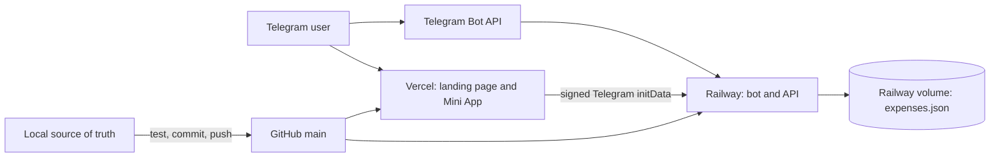

# Cribbit Project Structure

## Authority boundary

The authoritative editable project is:

```text
C:\Users\GrowB\cribbit-bot
```

All changes begin here. GitHub is the versioned mirror and deployment handoff. Railway and Vercel are generated runtimes, never independent editing locations.

## Runtime architecture



## Directory map

```text
cribbit-bot/
├── .github/workflows/verify.yml  CI: install, test, and build
├── locales/                      Bot translations: en, fr, ar
├── public/
│   ├── locales/                  Browser translations
│   ├── app.html                  Mini App/dashboard document
│   ├── app.js                    UI state, API calls, actions
│   ├── i18n.js                   Browser localization
│   ├── index.html                Public landing page
│   ├── logo.png                  Canonical Cribbit logo
│   ├── styles.css                Responsive application styles
│   └── vercel.json               Legacy public config; root config wins
├── scripts/build-vercel.js       Deterministic public-to-dist build
├── src/
│   ├── balances.js               Balances and settlement simplification
│   ├── bot-commands.js            Telegram command definitions
│   ├── chores.js                 Chore and assignment parsing
│   ├── dashboard-links.js        Canonical Mini App URL construction
│   ├── dashboard-server.js       Health and authenticated JSON API
│   ├── expenses.js               Natural-language expense parsing
│   ├── i18n.js                   Server localization
│   ├── store.js                  Persistent data and mutations
│   └── telegram-auth.js          Telegram initData verification
├── test/cribbit.test.js          Regression and integration tests
├── .env.example                  Non-secret environment template
├── .gitignore                    Secret/data/build exclusions
├── index.js                      Bot and API entry point
├── package.json                  Scripts and dependencies
├── package-lock.json             Dependency lock
├── vercel.json                   Vercel build and routing authority
├── README.md                     Operator/contributor handbook
├── requirements.md               Product and protection requirements
├── structure.md                  This ownership map
└── plan.md                       Ordered project plan
```

## Component boundaries

| Component | Owns | Must not do |
| --- | --- | --- |
| `index.js` | Bot/API startup, handlers, menu synchronization | Embed deployment secrets or browser UI |
| `src/store.js` | Persistent state and membership lookups | Trust browser-supplied membership or write outside `DATA_DIR` |
| `src/telegram-auth.js` | Signature, timestamp, and Telegram identity validation | Accept unsigned or expired data |
| `src/dashboard-server.js` | Health, discovery, dashboard, and mutation endpoints | Return protected data before authentication and membership checks |
| `src/dashboard-links.js` | One canonical `/app` URL shape | Generate `/app/app` or bind the global button to one group |
| `public/*` | Landing page and Mini App presentation | Store secrets or become the data authority |
| `scripts/build-vercel.js` | Copy required assets into `dist/` | Modify source or deploy |

## Data model

The JSON store is partitioned by Telegram `chatId` and contains:

- `expenses`
- `chores`
- `members`
- `memberProfiles`
- `groceries`
- `activity`
- `settings`
- `processedUpdates`
- `userPreferences`

Production data belongs on the Railway volume through `DATA_DIR` or `RAILWAY_VOLUME_MOUNT_PATH`. `expenses.json` is runtime data and must never be committed.

## HTTP interface

| Method | Route | Protection | Purpose |
| --- | --- | --- | --- |
| `GET` | `/health` | Public | Liveness check |
| `GET` | `/api/houses` | Valid Telegram `initData` | Find active group memberships |
| `GET` | `/api/dashboard?chatId=…` | Valid `initData` and active membership | Load one house |
| `POST` | `/api/action` | Valid `initData` and active membership | Run an allow-listed mutation |

Vercel `/app` is canonical. `/dashboard` is a compatibility alias that returns the same `app.html`.

## Telegram launch paths

- `/dashboard` produces a group-specific URL containing `chatId` and `apiBaseUrl`.
- The global blue **Cribbit** button uses `/app?apiBaseUrl=…` without a group ID.
- Signed Telegram identity lets the Mini App discover zero, one, or multiple eligible houses.

## Generated and quarantined files

- `dist/` is generated by `npm run build` and ignored by Git.
- `.env` and `expenses.json` are ignored local/runtime files.
- Root `vercel.json` is authoritative; `public/vercel.json` must not be used to create or configure a second project.
- `audit-state.md` is a historical recovery note, not current authority.
- The untracked extensionless `index` is obsolete. Never run, stage, deploy, or use it as a reference. Remove/archive it only with explicit owner approval.
